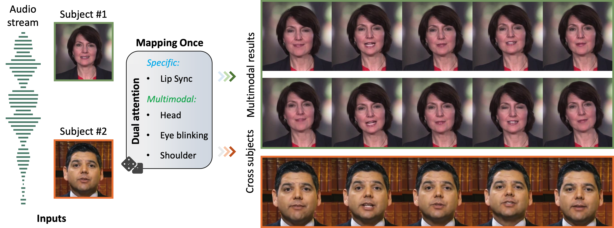

<div align="center">

<h2> <font color="#FF9933">M</font><font color="#66CCFF">O</font><font color="#FFCC00">D</font><font color="#33CC66">A</font>: <span style="font-size:18px"> <font color="#FF9933">M</font>apping-<font color="#66CCFF">O</font>nce Audio-driven Portrait Animation with <font color="#FFCC00">D</font>ual <font color="#33CC66">A</font>ttentions</nobr></span> </h2>

  <a href='https://arxiv.org/abs/2307.10008'></a> &nbsp; <a href='https://liuyunfei.net/projects/iccv23-moda/'></a> &nbsp; [](#) &nbsp; [](#) &nbsp; 

<div>
    <nobr><a href="http://liuyunfei.net"
  >Yunfei Liu</a><sup>1</sup>,</nobr>
  <nobr><a href="https://scholar.google.com.hk/citations?user=Xf5_TfcAAAAJ&hl=zh-CN"
  >Lijian Lin</a><sup>1</sup>,</nobr>
  <nobr>Fei Yu<sup>2</sup>,</nobr>
  <nobr>Changyin Zhou<sup>2</sup>,</nobr>
  <nobr><a href="https://yu-li.github.io/"
  >Yu Li</a><sup>1</sup></nobr>
 <br>
  <nobr><sup>1</sup><a href="https://www.idea.edu.cn">International Digital Economy Academy (IDEA), Shenzhen, China</a>,&nbsp;&nbsp;</nobr>
  <nobr><sup>2</sup><a href="https://www.vistring.ai">Vistring Inc., Hangzhou, China</a></nobr>
</div>
<br>
<i>—<strong><a href='https://arxiv.org/abs/2307.10008' target='_blank'>ICCV 2023</a></strong>—</i>
<br>
<br>




<br>

</div>

## 🕊️ Description

MODA is a unified system for multi-person, diverse, and high-fidelity talking portrait generation.

## 🎊 News

* `2023/08/13` Inference codes have been released.
* `2023/08/13` Data preprocessing scripts have been released.


## 🛠️ Installation

After cloning the repository please install the environment by running the `install.sh` script. It will prepare the MODA for usage. 

```shell
git clone https://github.com/DreamtaleCore/MODA.git
cd MODA
bash ./install.sh
```

## 🚀 Usage

Download pretrained models from [here](https://drive.google.com/drive/folders/1AE5BOQ6o0CqHIdKcbRJg1-MbJLKXqvlu?usp=drive_link). Then put all files and subfolders to `assets/`.

Quick run
```shell
python inference.py
```

Then a few minutes later ☕, the results will be generated at `results/`.

Parameters:
```shell
usage: Inference entrance for MODA. [-h] [--audio_fp_or_dir AUDIO_FP_OR_DIR] [--person_config PERSON_CONFIG]
                                    [--output_dir OUTPUT_DIR] [--n_sample N_SAMPLE]

optional arguments:
  -h, --help            show this help message and exit
  --audio_fp_or_dir AUDIO_FP_OR_DIR
  --person_config PERSON_CONFIG
  --output_dir OUTPUT_DIR
  --n_sample N_SAMPLE
```

## 🍏 Dataset preparation

```
cd data_prepare

python process.py -i your/video/dir -o your/output/dir
```

More informations please refer to [here](data_prepare/README.md).

## 🏃 Train

### Train the MODA model and FaCo model

```shell
python train.py --config configs/train/moda.yaml
```

```shell
python train.py --config configs/train/faco.yaml
```

### Train the renderer for new avatar

```shell
python train_renderer.py --config configs/train/renderer/Cathy.yaml
```

### Link your models

```shell
ln -s your_absolute_dir/TrainMODAVel/Audio2FeatureVertices/best_MODA.pkl assets/ckpts/MODA.pkl
```

```shell
ln -s your_absolute_dir/TrainFaCoModel/Audio2FeatureVertices/best_FaCo_G.pkl assets/ckpts/FaCo.pkl
```

```shell
ln -s your_absolute_dir/Render/TrainRenderCathy/Render/best_Render_G.pkl assets/ckpts/renderer/Cathy.pth
```

Then update the ckpt filepath in your config files.

## 🚧 TODO

- [x] Release the inference code
- [x] Data preprocessing scripts
- [x] Prepare the pretriained-weights
- [x] Release the training code
- [ ] Prepare the huggingface🤗 demo

## 🛎 Citation

If you find our work useful in your research, please consider citing:

```bibtex
@inproceedings{liu2023MODA,
  title={MODA: Mapping-Once Audio-driven Portrait Animation with Dual Attentions},
  author={Liu, Yunfei and Lin, Lijian and Fei, Yu and Changyin, Zhou, and Yu, Li},
  booktitle={Proceedings of the IEEE/CVF International Conference on Computer Vision},
  year={2023}
}
```

## 🥂 Acknowledgement
Our code is based on [LiveSpeechPortrait](https://github.com/YuanxunLu/LiveSpeechPortraits) and [FaceFormer](https://github.com/EvelynFan/FaceFormer).